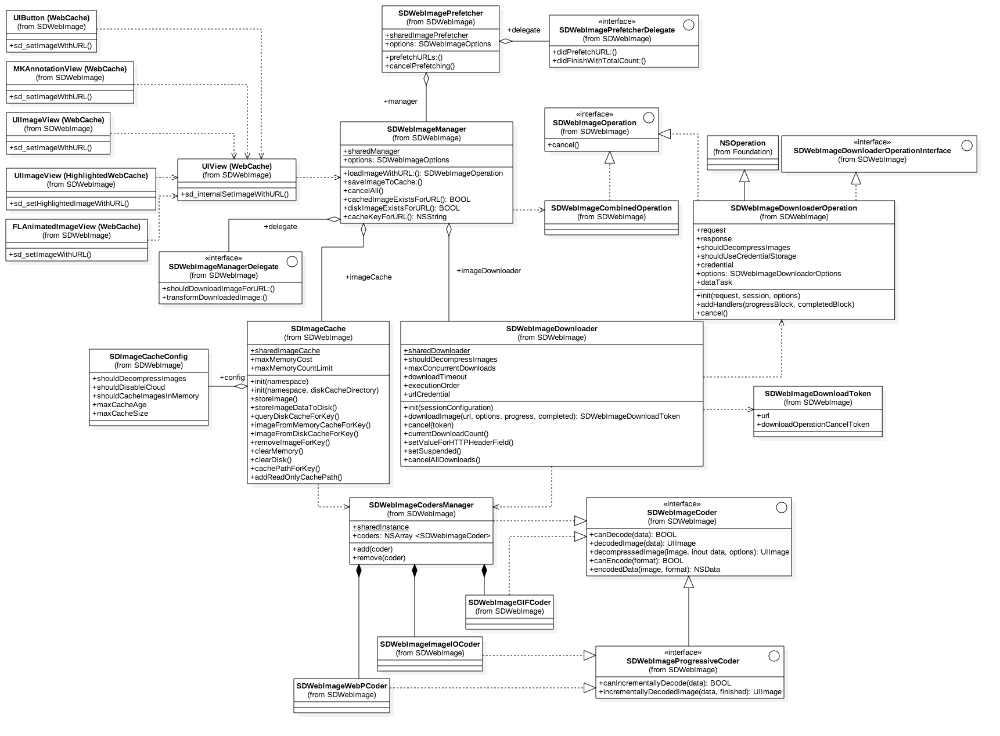

[TOC]

## 概述

本文为笔者在阅读 [SDWebImage](https://github.com/rs/SDWebImage#author) 时的笔记，帮助自己加深印象，让学习一步一个脚印，也希望能帮到其他人。

### 流程图

学习 SDWebImage 就不得不看官方提供的流程图和 UML 图：




阅读源码之前，首先通过对源文件进行分组来查看源码的文件结构，分组方式1（[SDWebImage 源码解析](https://zhuanlan.zhihu.com/p/27456754)）：


分组方式2：


或参考以下 Workflow（[搬好小板凳看SDWebImage源码解析（一）](http://www.cocoachina.com/ios/20171218/21566.html)）：


再来看一个框架的调用流程图（[SDWebImage源码解析](https://www.jianshu.com/p/93696717b4a3)）：


### 源码阅读

#### sd_internalSetImageWithURL

`UIImageView +WebCache` 暴露了很多调用灵活的接口，其最终都会调用到 `UIView+WebCache` 分类的如下方法中：

```objective-c
- (void)sd_internalSetImageWithURL:(nullable NSURL *)url
                  placeholderImage:(nullable UIImage *)placeholder
                           options:(SDWebImageOptions)options
                      operationKey:(nullable NSString *)operationKey
                     setImageBlock:(nullable SDSetImageBlock)setImageBlock
                          progress:(nullable SDWebImageDownloaderProgressBlock)progressBlock
                         completed:(nullable SDExternalCompletionBlock)completedBlock;
```

因为 SDWebImage 框架也支持 UIButton 的下载图片等方法，所以需要在它们的父类 `UIView` 里面统一一个下载方法（[SDWebImage源码解析](https://www.jianshu.com/p/93696717b4a3)）。


该方法里执行了如下操作：

- 先取消正在进行的operation
- options ！= SDWebImageDelayPlaceholder 就先展示占位图
- url存在：
  - 创建加载指示器菊花
  - 获取manager
  - 调用manager的loadImage:::方法，并返回operation，loadImage:::结束的回调里执行如下步骤：
    - 停掉加载指示器（菊花）
    - 根据需要标记为progress的完成状态
    - 不需要设置图片的情况：
      - 如果需要调用completedBlock回调，就在主线程中执行completedBlock回调
    - 需要设置图片的情况：
      - 图片存在，且没有设置SDWebImageAvoidAutoSetImage：targetImage = image, targetData = data;
      - 图片不存在，且设置了延迟展示占位图：targetImage = placeholder, targetData = nil;
      - 加载结束 且 （options为图片强制转场 或 cacheType为None），就设置transition = sself.sd_imageTransition;
      - 回到主线程中设置图片：即调用sd_setImage:imageData:basedOnClassOrViaCustomSetImageBlock:transition:cacheType:imageURL:方法，如果group存在，则设置图片和完成回调的的操作需要加入group，不存在group则直接调用设置图片的方法，最后主线程调用回调block
  - load操作结束后，为UIView绑定新的operation，因为之前把UIView上的操作取消了
- url不存在：
  - 停掉加载指示器（菊花）
  - 调用completedBlock回调，在其中返回错误信息

```objective-c
/*
 先取消正在进行的operation
 options ！= SDWebImageDelayPlaceholder 就先展示占位图
 url存在：
    创建加载指示器菊花
    获取manager
    调用manager的loadImage:::方法，并返回operation，loadImage:::结束的回调里执行如下步骤：
        停掉加载指示器（菊花）
        根据需要标记为progress的完成状态
        不需要设置图片的情况：
            如果需要调用completedBlock回调，就在主线程中执行completedBlock回调
        需要设置图片的情况：
            图片存在，且没有设置SDWebImageAvoidAutoSetImage：targetImage = image, targetData = data;
            图片不存在，且设置了延迟展示占位图：targetImage = placeholder, targetData = nil;
            加载结束 且 （options为图片强制转场 或 cacheType为None），就设置transition = sself.sd_imageTransition;
            回到主线程中设置图片：即调用sd_setImage:imageData:basedOnClassOrViaCustomSetImageBlock:transition:cacheType:imageURL:方法，如果group存在，则设置图片和完成回调的的操作需要加入group，不存在group则直接调用设置图片的方法，最后主线程调用回调block
    load操作结束后，为UIView绑定新的operation，因为之前把UIView上的操作取消了
 url不存在：
    停掉加载指示器（菊花）
    调用completedBlock回调，在其中返回错误信息
 */
- (void)sd_internalSetImageWithURL:(nullable NSURL *)url
                  placeholderImage:(nullable UIImage *)placeholder
                           options:(SDWebImageOptions)options
                      operationKey:(nullable NSString *)operationKey
                     setImageBlock:(nullable SDSetImageBlock)setImageBlock
                          progress:(nullable SDWebImageDownloaderProgressBlock)progressBlock
                         completed:(nullable SDExternalCompletionBlock)completedBlock
                           context:(nullable NSDictionary<NSString *, id> *)context {
    //valid key：UIImageView || UIButton || NSButton || UIView
    NSString *validOperationKey = operationKey ?: NSStringFromClass([self class]);
    //下面这行代码是保证没有当前正在进行的异步下载操作, 使它不会与即将进行的操作发生冲突（取消UIImageView(UIView)上当前正在进行的异步下载，确保每个 UIImageView 对象中永远只存在一个 operation，当前只允许一个图片网络请求，该 operation 负责从缓存中获取 image 或者是重新下载 image）
    [self sd_cancelImageLoadOperationWithKey:validOperationKey];
    //用imageURLKey做key, 将url作为属性绑定到UIView上（类似于NSDictionary，其中 static char imageURLKey;）
    objc_setAssociatedObject(self, &imageURLKey, url, OBJC_ASSOCIATION_RETAIN_NONATOMIC);
    
    //“&”在这里是位运算符，if括号里面的运算表示：options的值不是“延迟占位图展示”的话就成立
    if (!(options & SDWebImageDelayPlaceholder)) {
        if ([context valueForKey:SDWebImageInternalSetImageGroupKey]) {
            dispatch_group_t group = [context valueForKey:SDWebImageInternalSetImageGroupKey];
            dispatch_group_enter(group);
        }
        //dispatch_main_async_safe是一个宏，保证在主线程安全执行
        dispatch_main_async_safe(^{
            //先展示占位图
            [self sd_setImage:placeholder imageData:nil basedOnClassOrViaCustomSetImageBlock:setImageBlock];
        });
    }
    
    if (url) {
#if SD_UIKIT
        // check if activityView is enabled or not
        //设置了activityView（正在加载指示器）为显示的话，那么就调用显示activityView的方法...
        if ([self sd_showActivityIndicatorView]) {
            //去创建菊花（activityView）然后转起来...
            [self sd_addActivityIndicator];
        }
#endif
        
        // reset the progress
        self.sd_imageProgress.totalUnitCount = 0;
        self.sd_imageProgress.completedUnitCount = 0;
        
        //获得manager
        SDWebImageManager *manager;
        if ([context valueForKey:SDWebImageExternalCustomManagerKey]) {
            manager = (SDWebImageManager *)[context valueForKey:SDWebImageExternalCustomManagerKey];
        } else {
            manager = [SDWebImageManager sharedManager];
        }
        
        __weak __typeof(self)wself = self;
        //创建了一个block，会作为参数传入manager的loadImageWithURL:::方法
        SDWebImageDownloaderProgressBlock combinedProgressBlock = ^(NSInteger receivedSize, NSInteger expectedSize, NSURL * _Nullable targetURL) {
            wself.sd_imageProgress.totalUnitCount = expectedSize;
            wself.sd_imageProgress.completedUnitCount = receivedSize;
            if (progressBlock) {
                progressBlock(receivedSize, expectedSize, targetURL);
            }
        };
        
        //load操作开始，加载图片（从缓存中取或下载），并返回operation对象
        id <SDWebImageOperation> operation = [manager loadImageWithURL:url options:options progress:combinedProgressBlock completed:^(UIImage *image, NSData *data, NSError *error, SDImageCacheType cacheType, BOOL finished, NSURL *imageURL) {
            __strong __typeof (wself) sself = wself;
            //如果 self被提前释放了，直接返回
            if (!sself) { return; }
#if SD_UIKIT
            //先把菊花停掉...
            [sself sd_removeActivityIndicator];
#endif
            // if the progress not been updated, mark it to complete state
            //加载结束 且 没有错误 且 progress的值没发生变化，说明没有更新progress，就把progress标记为完成状态
            if (finished && !error && sself.sd_imageProgress.totalUnitCount == 0 && sself.sd_imageProgress.completedUnitCount == 0) {
                sself.sd_imageProgress.totalUnitCount = SDWebImageProgressUnitCountUnknown;
                sself.sd_imageProgress.completedUnitCount = SDWebImageProgressUnitCountUnknown;
            }
            
            //加载结束了 或者 options为不自动设置图片，标记应该调用完成回调
            BOOL shouldCallCompletedBlock = finished || (options & SDWebImageAvoidAutoSetImage);
            
            //（图片存在 但 options为不自动设置图片）  或者  （图片不存在 且 options为延迟设置占位图），标记不设置图片
            BOOL shouldNotSetImage = ((image && (options & SDWebImageAvoidAutoSetImage)) ||
                                      (!image && !(options & SDWebImageDelayPlaceholder)));
            
            SDWebImageNoParamsBlock callCompletedBlockClojure = ^{
                //如果 self被提前释放了，直接返回
                if (!sself) { return; }
                //需要直接设置图片的话，直接调用setNeedsLayout
                if (!shouldNotSetImage) {
                    [sself sd_setNeedsLayout];
                }
                //执行completedBlock回调，并将图片用block带回去
                if (completedBlock && shouldCallCompletedBlock) {
                    completedBlock(image, error, cacheType, url);
                }
            };
            
            // case 1a: we got an image, but the SDWebImageAvoidAutoSetImage flag is set
            // OR
            // case 1b: we got no image and the SDWebImageDelayPlaceholder is not set
            if (shouldNotSetImage) {
                //如果不需要设置图片，则在主线程中执行上面的 callCompletedBlockClojure block
                dispatch_main_async_safe(callCompletedBlockClojure);
                return;
            }
            
            //以下均为需要设置图片的情况
            UIImage *targetImage = nil;
            NSData *targetData = nil;
            if (image) { //图片存在，且没有设置SDWebImageAvoidAutoSetImage（因为图片存在 且 设置了SDWebImageAvoidAutoSetImage的情况已经在上面return掉了）
                // case 2a: we got an image and the SDWebImageAvoidAutoSetImage is not set
                targetImage = image;
                targetData = data;
            } else if (options & SDWebImageDelayPlaceholder) { //图片不存在，且设置了延迟展示占位图
                // case 2b: we got no image and the SDWebImageDelayPlaceholder flag is set
                targetImage = placeholder;
                targetData = nil;
            }
            
#if SD_UIKIT || SD_MAC
            // check whether we should use the image transition
            SDWebImageTransition *transition = nil;
            //加载结束 且 （options为图片强制转场 或 cacheType为None）
            if (finished && (options & SDWebImageForceTransition || cacheType == SDImageCacheTypeNone)) {
                transition = sself.sd_imageTransition;
            }
#endif
            if ([context valueForKey:SDWebImageInternalSetImageGroupKey]) {
                //如果group存在，则使用group
                dispatch_group_t group = [context valueForKey:SDWebImageInternalSetImageGroupKey];
                dispatch_group_enter(group);
                dispatch_main_async_safe(^{
#if SD_UIKIT || SD_MAC
                    [sself sd_setImage:targetImage imageData:targetData basedOnClassOrViaCustomSetImageBlock:setImageBlock transition:transition cacheType:cacheType imageURL:imageURL];
#else
                    [sself sd_setImage:targetImage imageData:targetData basedOnClassOrViaCustomSetImageBlock:setImageBlock];
#endif
                });
                // ensure completion block is called after custom setImage process finish
                dispatch_group_notify(group, dispatch_get_main_queue(), ^{
                    callCompletedBlockClojure();
                });
            } else {
                //group不存在，直接回到主线程中设置图片
                dispatch_main_async_safe(^{
#if SD_UIKIT || SD_MAC
                    [sself sd_setImage:targetImage imageData:targetData basedOnClassOrViaCustomSetImageBlock:setImageBlock transition:transition cacheType:cacheType imageURL:imageURL];
#else
                    [sself sd_setImage:targetImage imageData:targetData basedOnClassOrViaCustomSetImageBlock:setImageBlock];
#endif
                    callCompletedBlockClojure();
                });
            }
        }];
        
        //load操作结束后，为UIView绑定新的操作，因为之前把UIView上的操作取消了。
        [self sd_setImageLoadOperation:operation forKey:validOperationKey];
    } else {
        
        //url不存在的情况
        dispatch_main_async_safe(^{
#if SD_UIKIT
            //把菊花停掉...
            [self sd_removeActivityIndicator];
#endif
            //执行completedBlock回调，并带入url为空的错误提示
            if (completedBlock) {
                NSError *error = [NSError errorWithDomain:SDWebImageErrorDomain code:-1 userInfo:@{NSLocalizedDescriptionKey : @"Trying to load a nil url"}];
                completedBlock(nil, error, SDImageCacheTypeNone, url);
            }
        });
    }
}
```

#### UIView+WebCacheOperation 

在 `sd_internalSetImageWithURL` 的一开始执行了一个取消操作 `[self sd_cancelImageLoadOperationWithKey:validOperationKey];` ，取消 UIImageView(UIView) 上当前正在进行的异步下载，确保每个 UIImageView 对象中永远只存在一个 operation，当前只允许一个图片网络请求，该 operation 负责从缓存中获取 image 或者是重新下载 image。`sd_cancelImageLoadOperationWithKey` 的方法实现位于 `UIView+WebCacheOperation`， `UIView+WebCacheOperation.m` 中的内容如下：

```objective-c
#import "UIView+WebCacheOperation.h"
#import "objc/runtime.h"

static char loadOperationKey;

// key is copy, value is weak because operation instance is retained by SDWebImageManager's runningOperations property
// we should use lock to keep thread-safe because these method may not be acessed from main queue
typedef NSMapTable<NSString *, id<SDWebImageOperation>> SDOperationsDictionary;

//这些方法用来取消 UIView 的图像加载，它们是内部使用的，而不是公开的。所有这些存储型operations是weak的，所以，图像加载完毕后他们呢就会销毁，如果你需要存储这些operations，请使用你自己的类强引用他们
//可以这么理解，UIView有个NSMapTable类型的属性operations，它通过键值的方式来保存opration
@implementation UIView (WebCacheOperation)

//相当于通过Associate为UIView添加了一个NSMapTable类型的属性
- (SDOperationsDictionary *)sd_operationDictionary {
    @synchronized(self) {
        //operations的真实类型是NSMapTable
        SDOperationsDictionary *operations = objc_getAssociatedObject(self, &loadOperationKey);
        if (operations) {
            return operations;
        }
        //operations的key是强引用，value是弱引用
        operations = [[NSMapTable alloc] initWithKeyOptions:NSPointerFunctionsStrongMemory valueOptions:NSPointerFunctionsWeakMemory capacity:0];
        //通过loadOperationKey为UIView绑定一个operations（类似于NSDictionary）
        objc_setAssociatedObject(self, &loadOperationKey, operations, OBJC_ASSOCIATION_RETAIN_NONATOMIC);
        return operations;
    }
}

//存储图像加载的operation（该operation通过一个weak的 map table 存储在UIView中）
- (void)sd_setImageLoadOperation:(nullable id<SDWebImageOperation>)operation forKey:(nullable NSString *)key {
    if (key) {
        //先取消
        [self sd_cancelImageLoadOperationWithKey:key];
        if (operation) {
            //获取UIView通过Associate添加的NSMapTable类型的绑定对象operationDictionary
            SDOperationsDictionary *operationDictionary = [self sd_operationDictionary];
            @synchronized (self) {
                //将operation通过key添加到UIView的绑定对象operationDictionary里
                [operationDictionary setObject:operation forKey:key];
            }
        }
    }
}

//取消UIView对应key的所有operations
- (void)sd_cancelImageLoadOperationWithKey:(nullable NSString *)key {
    // Cancel in progress downloader from queue
    //相当于通过Associate获得UIView的一个叫sd_operationDictionary的属性，其真实类型是NSMapTable，key是强引用，value是弱引用
    SDOperationsDictionary *operationDictionary = [self sd_operationDictionary];
    id<SDWebImageOperation> operation; //operation是一个遵守了SDWebImageOperation协议的对象
    @synchronized (self) {
        //operation是通过key存储在UIView的一个NSMapTable里
        operation = [operationDictionary objectForKey:key];
    }
    if (operation) {
        if ([operation conformsToProtocol:@protocol(SDWebImageOperation)]){
            //先取消
            [operation cancel];
        }
        @synchronized (self) {
            //再移除
            [operationDictionary removeObjectForKey:key];
        }
    }
}

//根据当前的UIVIew和key移除operations，而不取消
- (void)sd_removeImageLoadOperationWithKey:(nullable NSString *)key {
    if (key) {
        SDOperationsDictionary *operationDictionary = [self sd_operationDictionary];
        @synchronized (self) {
            [operationDictionary removeObjectForKey:key];
        }
    }
}

@end
```

#### loadImageWithURL

```objective-c
/*
 url的类型检查
 创建一个SDWebImageCombinedOperation类型的operation
 如果url不合法，或失败过且失败了也不重试，则执行一个url不合法的Completion回调
 （接下来为url合法的情况）
 将operation加入self.runningOperations
 去缓存中查找图片，且返回一个NSOperation对象，保存在SDWebImageCombinedOperation的实例operation的cacheOperation属性里
    （接下来为查找结果的回调）
    需要从网络下载图片：
        执行回调callCompletionBlockForOperation
        从网络下载图片，返回一个SDWebImageDownloadToken类型的对象，保存在SDWebImageCombinedOperation的实例operation的downloadToken属性里
            (下载结束的回调)
            operation被提前释放了，或者operation的任务被取消了，什么都不做
            (否则，下载出错了)
            执行回调callCompletionBlockForOperation，传入错误信息
            判断是否要把失败的url存入self.failedURLs
            (其他情况)
            如果options是失败后重试，则把url从self.failedURLs移除掉
            ... ...
    不需要从网络下载图片，且在缓存中找到了图片，执行回调callCompletionBlockForOperation
    不需要从网络下载图片，且没有在缓存中找到图片，执行回调callCompletionBlockForOperation
 返回一个保存了查询队列NSOperation的SDWebImageCombinedOperation实例operation
 */
```


## 参考

- [SDWebImage 源码解析](https://zhuanlan.zhihu.com/p/27456754)
- [搬好小板凳看SDWebImage源码解析（一）](http://www.cocoachina.com/ios/20171218/21566.html)
- [SDWebImage源码解析](https://www.jianshu.com/p/93696717b4a3)
- [SDWebImage源码阅读(上)](https://juejin.im/post/5a573387518825734501713a)：一行一行的注释