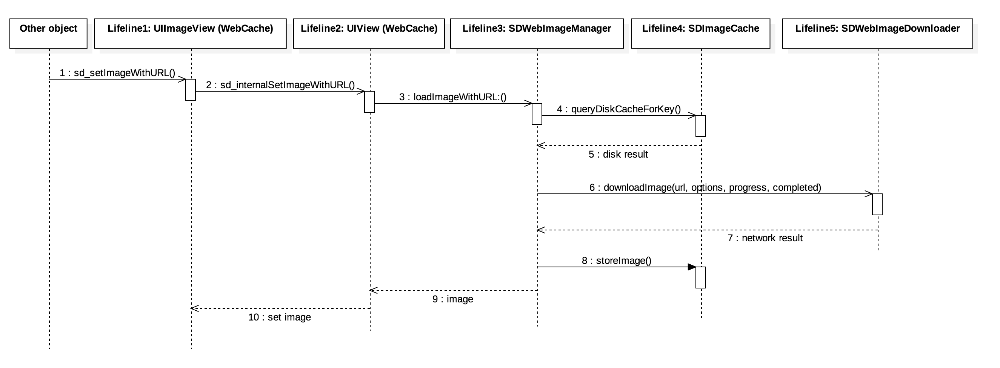

[TOC]

## 概述

本文为笔者在阅读 [SDWebImage](https://github.com/rs/SDWebImage#author) 时的笔记，帮助自己加深印象，让学习一步一个脚印，也希望能帮到其他人。

### 流程图

学习 SDWebImage 就不得不看官方提供的流程图和 UML 图：




阅读源码之前，首先通过对源文件进行分组来查看源码的文件结构，分组方式1（[SDWebImage 源码解析](https://zhuanlan.zhihu.com/p/27456754)）：


分组方式2：


或参考以下 Workflow（[搬好小板凳看SDWebImage源码解析（一）](http://www.cocoachina.com/ios/20171218/21566.html)）：


再来看一个框架的调用流程图（[SDWebImage源码解析](https://www.jianshu.com/p/93696717b4a3)）：


### 源码阅读

`UIImageView +WebCache` 暴露了很多调用灵活的接口，其最终都会调用到 `UIView+WebCache` 分类的如下方法中：

```objective-c
- (void)sd_internalSetImageWithURL:(nullable NSURL *)url
                  placeholderImage:(nullable UIImage *)placeholder
                           options:(SDWebImageOptions)options
                      operationKey:(nullable NSString *)operationKey
                     setImageBlock:(nullable SDSetImageBlock)setImageBlock
                          progress:(nullable SDWebImageDownloaderProgressBlock)progressBlock
                         completed:(nullable SDExternalCompletionBlock)completedBlock;
```

因为 SDWebImage 框架也支持 UIButton 的下载图片等方法，所以需要在它们的父类 `UIView` 里面统一一个下载方法。


## 参考

- [SDWebImage 源码解析](https://zhuanlan.zhihu.com/p/27456754)
- [搬好小板凳看SDWebImage源码解析（一）](http://www.cocoachina.com/ios/20171218/21566.html)
- [SDWebImage源码解析](https://www.jianshu.com/p/93696717b4a3)